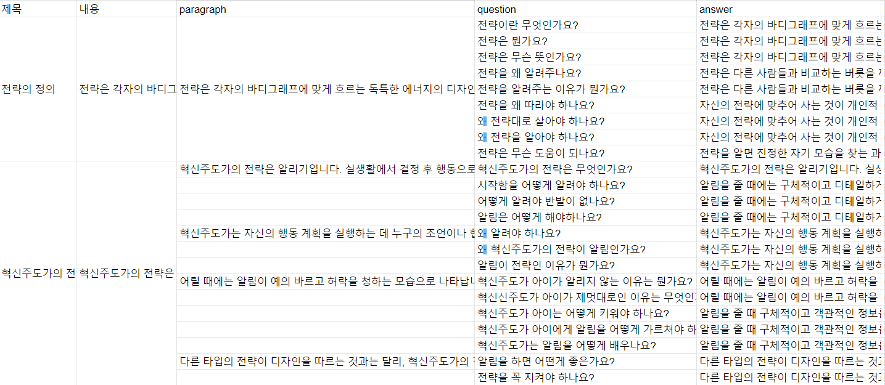

# KoELECTRA
ELECTRA 모델을 한국어 데이터로 학습시킨 KoELECTRA 모델을 이용해서 질의응답(QA) 모델 개발 진행하였다.
KoELECTRA 모델은 KorQuAD v2.0 형식에 맞춰서 학습이 진행되므로 형식에 맞는 질문, 답변 데이터를 만들어준 후에 학습을 진행했다.
데이터의 구축은 연구원들과 같이 직접 질문을 생각해서 작성했기 때문에 데이터의 질이 그렇게 높지는 않았다.
사용한 데이터의 수는 데이터 통합 전 502개의 질문과 126개의 문단을 사용했고 데이터 통합 후에는 61개의 문단을 사용해서 학습시켰다.

## Requirements
```
torch==1.6.0
transformers==3.5.1
seqeval
fastprogress
attrdict
``` 
## 개발 환경
```
Ubuntu 20.04 LTS gtx2080ti * 4
``` 

## 데이터 예시


**데이터를 구글 스프레드 시트에 정리하고 python 코드를 작성해서 json파일 형식으로 변환해서 학습에 사용하였다.**

## 마스터봇 2차 프로젝트에서 담당한 업무
- KoELECTRA 모델 학습 및 개발(학습 데이터와 변형된 질문으로 evaluation)
- 토큰화 라이브러리 비교 Mecab 등
- TF-IDF 분류 방법 적용

## 연구 과정 기록
<https://www.notion.so/QA-753758f2575945389f4e840ce1b1a79f>
